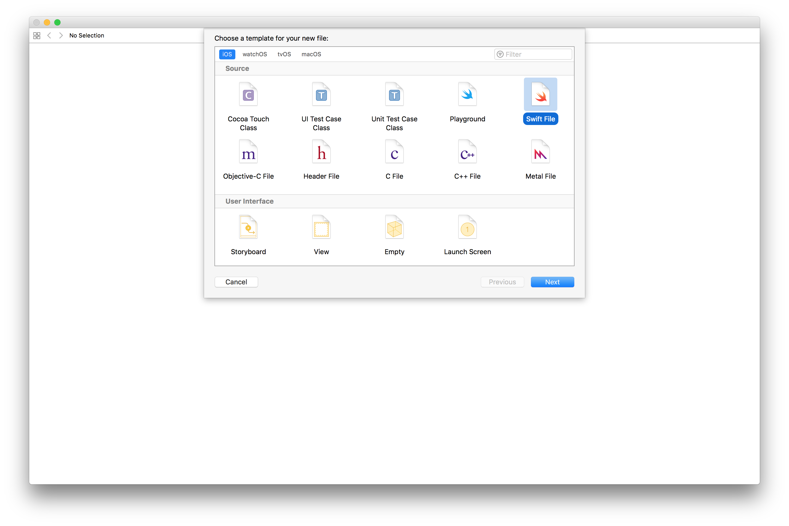
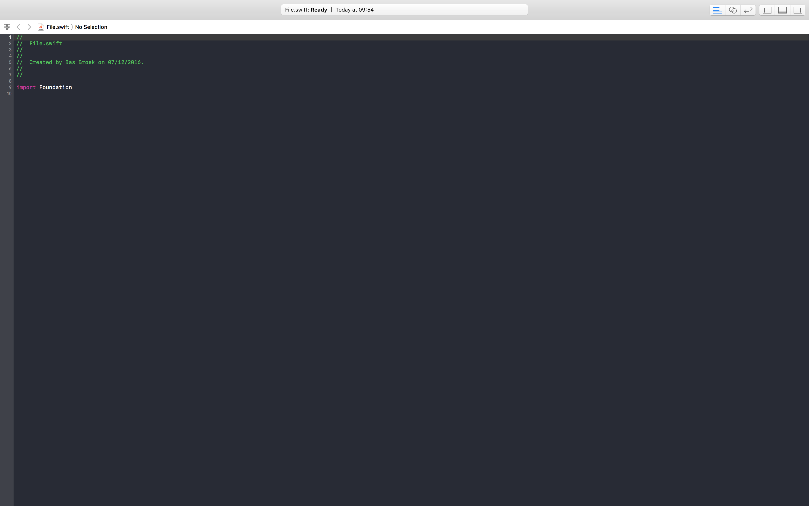
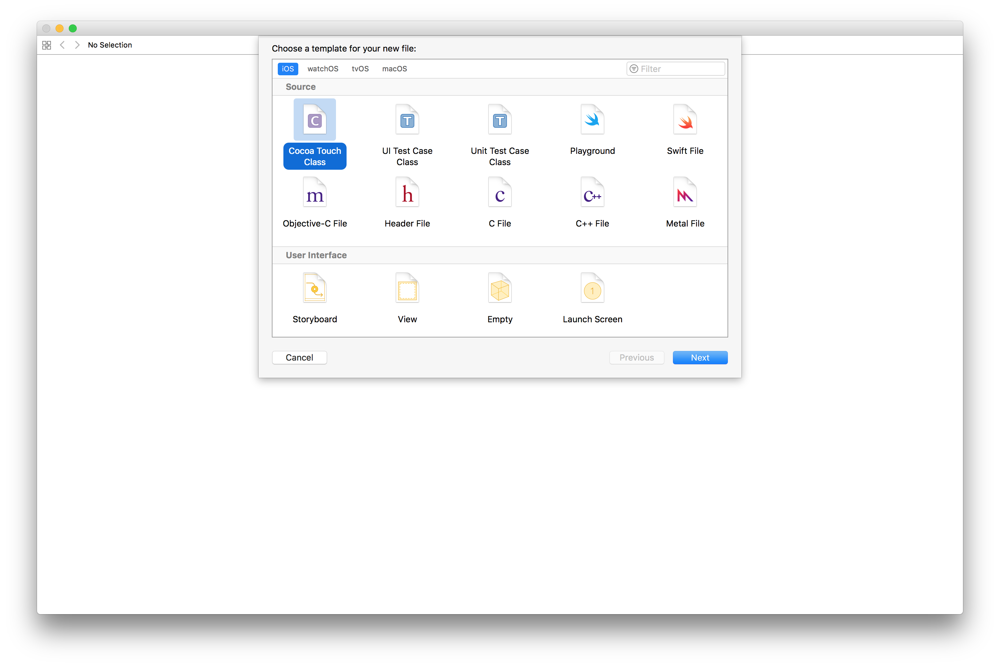
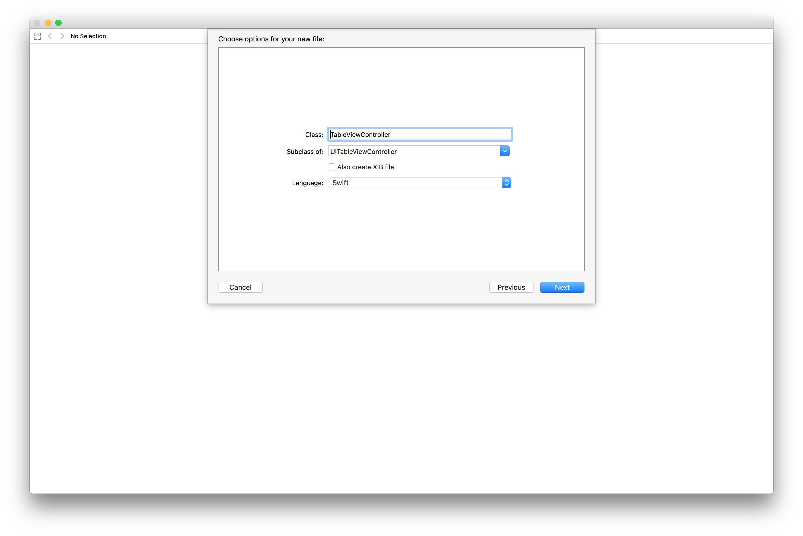
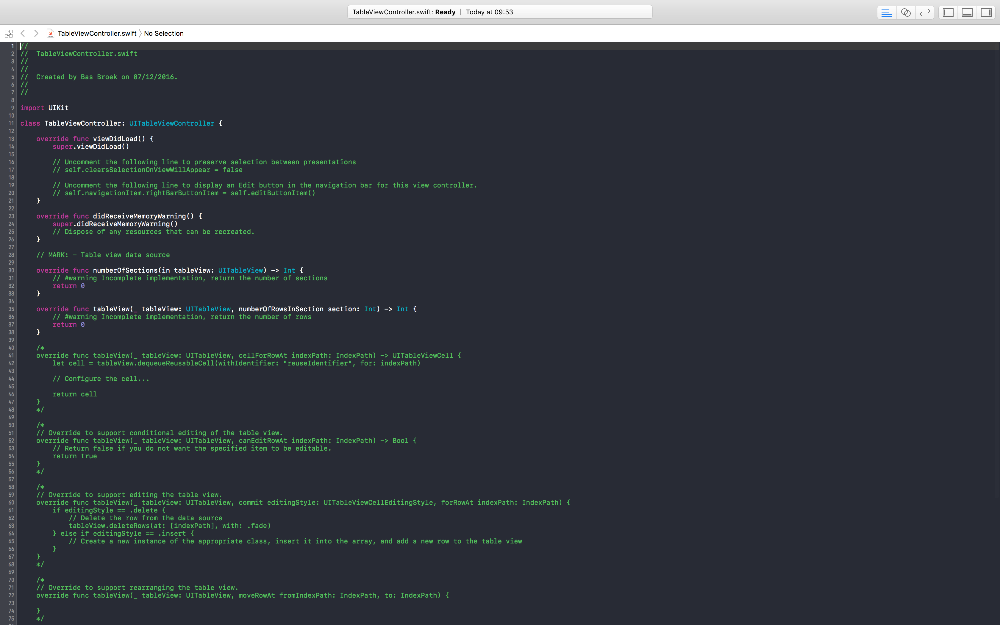

# [FIT] \(More\) Swift Basics
## Bas Broek

---

## Force! Casting

```swift
var statusCode: Int?

print(statusCode!) // crash

if statusCode != nil {
  print(statusCode!) // Please don't do this.
}

statusCode = 200

if let statusCode = statusCode  {
  print(statusCode) // Int, not Optional<Int>
}
```

---

## ??

```swift
var statusCode: Int?

let result1 = statusCode // Optional<Int>

let result2 = statusCode ?? 200 // Int

// Which is the same as

let result3 = (statusCode == nil) ? 200 : statusCode! // or
let result4 = (statusCode != nil) ? statusCode! : 200
```

---

## Enums

```swift
enum IntNumber: Int {
  case zero // = 0
  case one // = 1
}

enum StringNumber: String {
  case zero // = "zero"
  case one // = "one"
}

// Here, you get an initializer for free:

IntNumber(rawValue: 1) // .one
StringNumber(rawValue: "zero") // .zero
```

---

## [FIT] Con(struct)or

---

## [FIT] ~~Con(struct)or~~

---

## [FIT] Initializer

---

## Initializer

```swift
struct Book {
  let title: String
  let author: String
}

Book(title: "De IJzeren Wil", author: "Bas Haring")
```

---

## Meer Enums

```swift
func track(number: IntNumber) {
  print(number.rawValue)
}

// You can call this as

track(number: IntNumber.zero) // 0

// .. but also as

track(number: .zero) // 0
```

---

## Extensions

```swift
extension String {
  func localized() -> String {
    return NSLocalizedString(self, comment: "")
  }
}

"hello".localized()

extension Int {
  func times(task: (Int) -> Void) {
    (1...self).forEach {
      task($0)
    }
  }
}

3.times { number in
  print(number) // 1, 2, 3
}
```

---

## Typealias
[https://github.com/BasThomas/Analysis](https://github.com/BasThomas/Analysis)

```swift
public struct Analysis {
  public typealias Percentage = Double

  /// Returns the frequency of the specified word.
  ///
  /// - Parameter caseSensitive: Indicating if words
  /// should be counted regardless of their case sensitivity.
  /// Defaults to `false`.
  ///
  /// - Returns: A percentage based on the `wordCount()`.
  public func frequency(of word: String, caseSensitive: Bool = false) -> Percentage {
    return Double(occurrences(of: word, caseSensitive: caseSensitive)) / Double(wordCount()) * 100.0
  }
}

let analysis = "What is this?".analysed()
analysis.frequency(of: "what") // 33.33
```

---

## File creation



---



---



---



---


